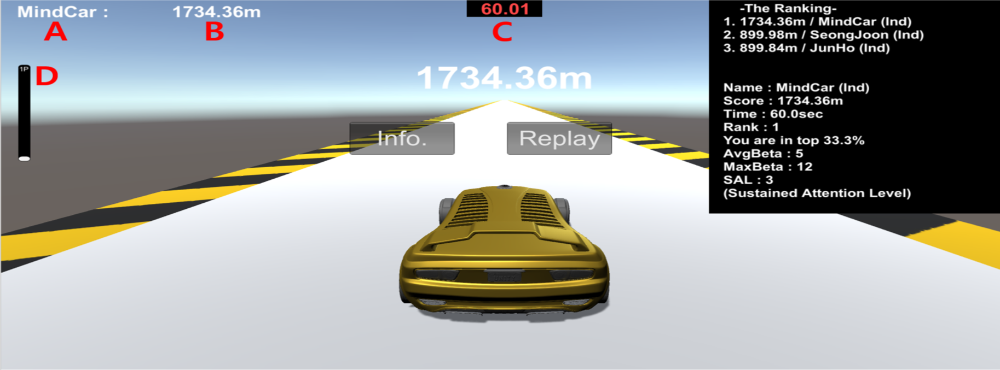
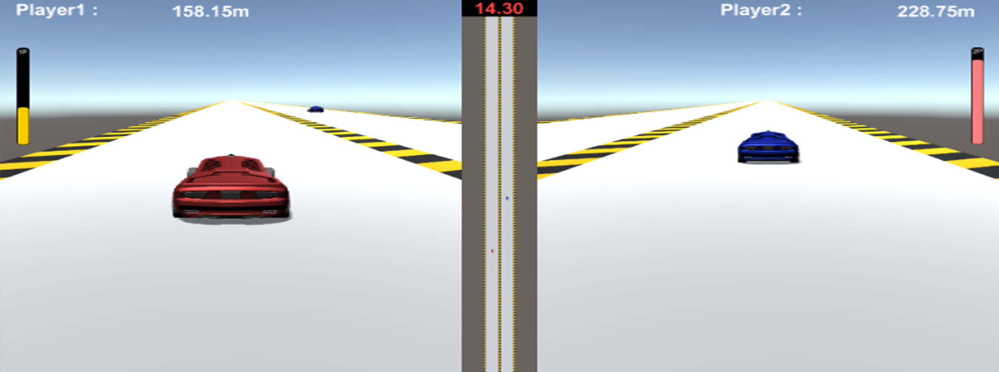
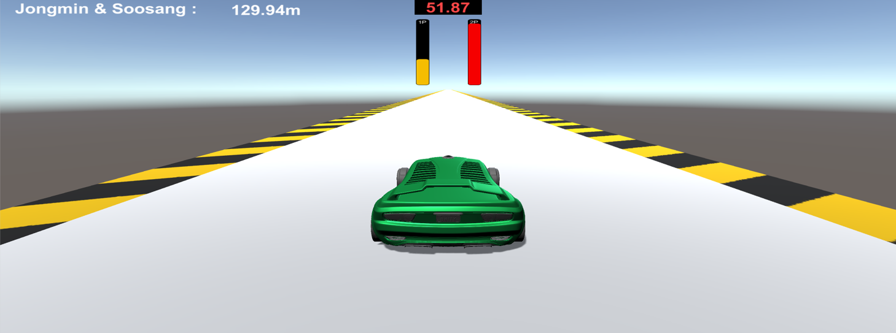
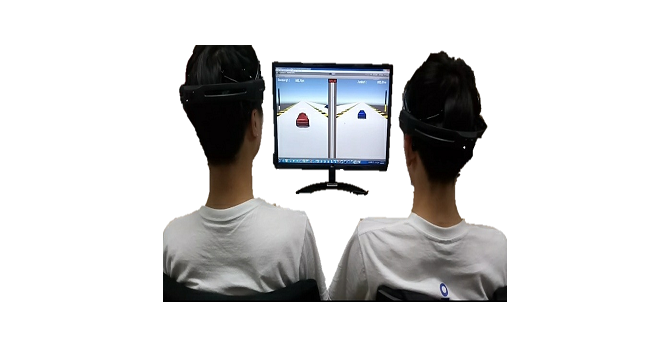
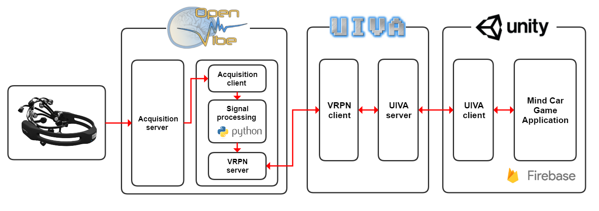

# MindCar

**MindCar**는 오픈소스 기반 뇌-컴퓨터 인터페이스(BCI: Brain-Computer Interface) 플랫폼들을 활용하여 개발된 뇌파게임입니다.

> 자세한 내용 및 사용방법은 본문 자료(메뉴얼)를 참고해주시기 바랍니다.

 

## 1. 게임 개요 ##

**MindCar**는 기본적으로 사용자가 자신의 뇌파 상태를 확인할 수 있도록 시·청각적 요소를 통해 피드백 되는 어플리케이션으로 제작이 되었습니다. 이를 통해 바이오피드백과 같이 사용자 스스로 자신의 뇌파 상태를 조절하도록 하는 훈련 및 연구에 사용되어 질 수 있을 것으로 기대되며, 현재 제작된 환경은 **다음의 특징**이 있습니다.

- 게임 내 학습 (In-Game Training)
- 멀티모달 피드백(Multi-modal Feedback)
- 게임화(Gamification)
- 맞춤형 뇌파분석(Customization)

 
**MindCar**는 최대 2인이 참여 할 수 있는 레이싱게임으로  `개인`, `경쟁`, `협동` 모드를 지원합니다.
> 자동차의 속력은 기본 값을 제외하고 10단계로 나누었으며, 각 모드에서의 공통된 목표는 정해진 시간동안 자동차가 더 먼 거리를 주행하도록 하는 것입니다. 예제에서는 집중력과 관련된 베타파 파워를 관심 뇌파로 설정하였습니다.

 

#### 1.1. 개별(Individual) 모드
: 단일 사용자로 특별한 외부조건 없이 정해진 시간 동안 진행되며, 게임이 끝난 뒤 총 주행거리 기록으로 순위를 결정하는 게임 방식입니다.

> <그림1> 개별 모드(Individual Mode) 및 게임 종료 후 화면
> : 게임 종료 후 Firebase를 통한 기록 순위와 개인의 다양한 뇌파 정보를 확인 할 수 있음. A는 사용자 이름, B는 주행 거리, C는 진행 시간, D는 속력에 따른 게이지를 나타냄.

 

#### 1.2. 경쟁(Competition) 모드
: 두 명의 사용자로 게임이 진행되며, 게임이 진행되는 동안 자신의 집중력 상태 뿐만 아니라, 상대방의 실시간 기록과 집중도를 확인할 수 있게 되어 단순히 집중만이 아닌 경쟁을 부추기는 환경이 추가된 게임 방식입니다.

> <그림2> 경쟁 모드(Competition Mode)
> : 두 사용자가 자신 및 상대방의 집중력 정도를 실시간으로 지각하는 방식의 뉴로피드백이 수행됨.

 

#### 1.3. 협동(Cooperation) 모드
: 각 사용자의 정규화 된 집중도가 <그림 3>과 같이 화면 가운데 두 개의 막대그래프를 통해 표현됩니다. 두 사람의 집중도가 일정 오차범위 내에서 동일할 경우, 집중도가 동기화 되었다고 판단하여 그 정도에 따라 속력이 달라지는 게임 방식입니다.

> <그림3> 협동 모드(Cooperation Mode)
> : 두 사용자의 게이지(집중도)가 동일한 단계에 위치할 때 자동차의 속력이 증가.

> <그림4> 경쟁 모드에서의 실제 실험
> : 두 사용자가 상대방보다 더 좋은 기록을 얻기 위해 경쟁적으로 더욱 집중하는 모습을 보여줌.

 

## 2. BCI 시스템 개발 환경

> <그림5> OpenViBE-UIVA-Unity3d 시스템 구조

<table>
<tr>
    <td><b> Emotiv EPOC+ </b></td>
    <td> Emotiv EPOC+는 <b>MindCar에 사용된 비침습식 뇌전도 측정 장비</b>로서, 14개 채널에서 초당 128개 이상의 샘플 측정이 가능합니다. 측정된 뇌파 정보는 Bluetooth를 통한 무선 통신으로 PC에 전달됩니다. </td>
</tr>
<tr>
    <td><b> OpenViBE 플랫폼 </b></td>
    <td> 뇌 신호의 실시간 수집, 필터링, 처리, 분류, 시각화를 가능하게 하며 <b>뇌-컴퓨터 인터페이스의 설계 및 테스트, 사용</b>에 특화된 오픈 소스 소프트웨어 플랫폼입니다. </td>
</tr>
<tr>
    <td><b> Python기반 신호처리모듈 </b></td>
    <td> 오픈소스로 대표되는 언어인 Python을 활용하였으며, OpenViBE 플랫폼 안에서 전달되는 뇌파 데이터를 <b>Python 코드를 통해 사용자의 편의에 맞게</b> 처리 가능하게 합니다. </td>
</tr>
<tr>
    <td><b> UIVA </b></td>
    <td> Unity3d 게임 엔진 상에서 <b>VRPN</b>(Virtual Reality Peripheral Network)을 적용할 수 있게 해주는 소켓 기반 미들웨어이며, 이를 OpenViBE에 내부적으로 구현된 VRPN 서버 및 클라이언트와 연결하여 <b>OpenViBE-Unity3d 데이터 통신</b>을 가능하게 합니다. </td>
</tr>
<tr>
    <td><b> Unity3d  </b></td>
    <td> 유니티는 <b>게임 개발 엔진</b>으로 다양한 플랫폼으로의 빌드, GUI의 직관성, 3D 모델링 및 실시간 클라우드 호스팅 데이터베이스인 Firebase와의 연동을 지원합니다. </td>
</tr>
</table>

 

## 3. 기대효과

- 개발된 BCI System과 뇌파게임 MindCar를 통해 연구소요 비용을 낮춤으로써 보다 많은 뇌 과학 및 뉴로피드백 연구자들이 연구 본연에 몰입할 수 있도록 도와줄 것으로 기대합니다.

- 바이오피드백을 통한 치료 목적으로의 적용으로 심리 및 의료 분야의 연구자들에게 사용될 것으로 기대합니다.

-  유니티를 통해 개발된 게임들을 뇌파게임으로 적용하고자 하는 개발자들에게 사용될 것으로 기대합니다.

- 다중 사용자의 상호작용이 뇌파 자가 조절에 미치는 영향에 대한 하이퍼스캐닝 연구에 활용될 수 있습니다.

 

## 4. References

- EPOC web-page (https://www.emotiv.com/epoc/).
- OpenViBE web-page (http://openvibe.inria.fr/).
- UIVA web-page (http://web.cs.wpi.edu/~gogo/hive/UIVA/).
- VRPN web-page (https://github.com/vrpn/vrpn/wiki/).
- Unity3d web-page (https://unity3d.com/kr/public-relations).
- Firebase web-page (https://firebase.google.com/).

 

## 5. About us

한동대학교 전산전자공학부

- 안민규 교수님
- 정성준, 김준호, 엄수상 학부생

광주과학기술원 전기전자컴퓨터공학부

- 전성찬 교수님
- 이성한 연구원

 

## 6. Contact

뇌파게임에 대해 궁금한 점이 있다면 jdd01299@naver.com 로 연락주시기 바랍니다.